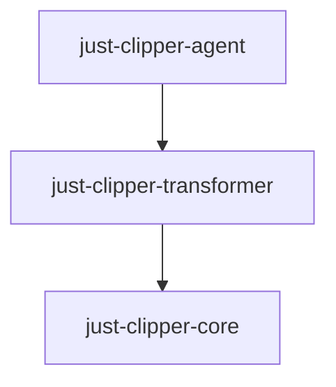

`Just Clipper` is a tool for desensitizing Java application program logs and front-end view layer objects. Its feature is non-invasiveness, which means that it can achieve desensitization effects without the need to modify existing projects.

[](https://github.com/4defaa/just-clipper/releases)[](http://www.apache.org/licenses/LICENSE-2.0)

[中文](./README_zh.md)

## Project Structure




## Implementation Principle

By using `javaagent` proxy and `javassist` bytecode modification technology, the bytecode of the target class is modified during the bytecode loading phase, achieving the desensitization effect.

## Applicable Scope

`springboot Project`、`Ordinary executable Jar`

## Using Configuration

Configuring Proxy：`-javaagent:just-clipper-agent-1.0.0-RELEASE.jar=clipper.yml`

## Configuration Instructions

The instructions for configuring `clipper.yaml` are as follows:

```yaml
clipper:
  debug: true							# Debugging, output the bytecode file modified by the target class, default value is false.
  log-config:
    enable : true                                                      # Enabling log desensitization, default value is false.
    rules :                                                            # Desensitization rules, using regular expressions.
      - regex: (客户姓名:[\u4E00-\u9FA5]+)[\u4E00-\u9FA5]{1}([\u4E00-\u9FA5]{1})
        replacement: $1*$2
      - regex: (客户姓名:[\u4E00-\u9FA5]{1})[\u4E00-\u9FA5]{1}
        replacement: $1*
      - regex: (身份证号:\d{4})\d{10}(\w{4})
        replacement: $1******$2
      - regex: (手机号:\d{3})\d{4}(\d{4})
        replacement: $1****$2
      - regex: (邮箱:\w{1,3})\w*(@\w*)
        replacement: $1***$2
      - regex: (银行卡号:\d{6})\w*(\d{4})
        replacement: $1******$2
  view-config:
    enable : true                              # Enabling desensitization of returned objects in the view layer, default value is false.
    scan-packages:                             # The package name where the view controller is located.
      - com.sdefaa.*
    urls:
      - /customers/query                       # The URL filtered for desensitization.
    rules :                                    # Desensitization rules, field names, and regular expressions.
      - keyword: name
        regex: ([\u4E00-\u9FA5]+)[\u4E00-\u9FA5]{1}([\u4E00-\u9FA5]{1})$
        replacement: $1*$2
      - keyword: name
        regex: ([\u4E00-\u9FA5]{1})[\u4E00-\u9FA5]{1}$
        replacement: $1*
      - keyword: phone
        regex: (1[3-9]{1}\d{1})\d{4}(\d{4})$
        replacement: $1****$2
      - keyword: phone
        regex: (\d{3,4})-\d{5,6}(\d{2})$
        replacement: $1****$2
      - keyword: phone
        regex: (\d{2})\d{5}(\d{3})$
        replacement: $1****$2
      - keyword: phone
        regex: (\d{2})\d{3,4}(\d{2})$
        replacement: $1****$2
      - keyword: identNo
        regex: (\d+)\w{6}$
        replacement: $1******
      - keyword: email
        regex: (\w{1,3})\w*(@\w*)
        replacement: $1***$2
      - keyword: bankNo
        regex: (\d{6})\w*(\d{4})$
        replacement: $1******$2
```

**Notes:**

- The desensitization effect depends on the quality of the regular expressions written in the configuration file.
- Log desensitization supports four types of log printing methods: `logback`, `log4j`, `jdk`, and `slf4j-simple`.
- The view controller where the desensitized `url` is located must be within the scanned package path, otherwise it will be invalid.
- The desensitized `url` is directly matched through the `value` or `path` attribute values of annotations such as `@PostMapping`, `@GetMapping`, `@PutMapping`, `@RequestMapping`, `@DeleteMapping`, and `@PatchMapping`. If the view controller adds a prefix to the request `url` with `@RequestMapping`, please do not add a prefix to the desensitized `url`, otherwise it will be invalid.
- The fields desensitized in the view layer are desensitized with `*`, so the type of the desensitized field should be `String` or a subclass of `CharSequence`.
- The returned objects in the view layer should be `Map`, `List`, or custom `POJO` objects.
- <span style="color:red">If the rules are configured but not effective, try checking the encoding of the configuration file.</span>

**Regular expression table for desensitizing common field information:**

| content                                                      | regex                                                       | replacement  |
| ------------------------------------------------------------ | ----------------------------------------------------------- | ------------ |
| Customer's legal name (three characters or more).            | `([\u4E00-\u9FA5]+)[\u4E00-\u9FA5]{1}([\u4E00-\u9FA5]{1})$` | `$1*$2`      |
| Customer's legal name (two characters).                      | `([\u4E00-\u9FA5]{1})[\u4E00-\u9FA5]{1}$`                   | `$1*`        |
| Bank card number.                                            | `(\d{6})\w*(\d{4})$`                                        | `$1******$2` |
| ID card number, military officer ID number, passport number. | `(\d+)\w{6}$`                                               | `$1******`   |
| Email address.                                               | `(\w{1,3})\w*(@\w*)`                                        | `$1***$2`    |
| Mainland China mobile phone number.                          | `(1[3-9]{1}\d{1})\d{4}(\d{4})$`                             | `$1****$2`   |
| Hong Kong and Macau mobile phone number.                     | `(\d{2})\d{3,4}(\d{2})$`                                    | `$1****$2`   |
| Taiwan mobile phone number.                                  | `(\d{2})\d{5}(\d{3})$`                                      | `$1****$2`   |
| Landline phone number.                                       | `(\d{3,4})-\d{5,6}(\d{2})$`                                 | `$1****$2`   |

<span style="color:red">Note: A field can use multiple regular expressions for matching. When writing regular expressions, consider the impact between multiple expressions and try to write non-interfering regular expressions.</span>
