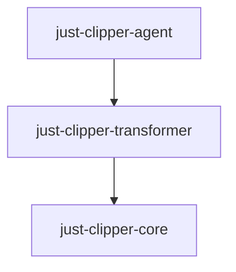

# Just Clipper

`Just Clipper`是一款`Java`应用程序日志脱敏和前端视图层对象脱敏的工具，它的特点是代码非侵入性，对于现有项目无需改造，就能实现脱敏的效果。

[]([https://github.com/4defaa/just-clipper/releases](https://github.com/4defaa/just-clipper/releases))[](http://www.apache.org/licenses/LICENSE-2.0)

## 项目结构




## 实现原理

通过`javaagent`代理和`javassist`字节码修改技术，在字节码加载阶段，实现目标类的字节码修改，达到脱敏的效果。

## 适用范围

`springboot项目`、`普通可执行Jar`

## 使用配置

配置代理 ：`-javaagent:just-clipper-agent-1.0.0-RELEASE.jar=clipper.yml`

## 配置说明

`clipper.yaml`配置说明如下:

```yaml
clipper:
  debug: true																		# 调试，输出目标类修饰过的字节码文件，默认值false
  log-config:
    enable : true                                                                          # 开启日志脱敏，默认值false
    rules :                                                                                # 脱敏规则，使用正则表达式
      - regex: (客户姓名:[\u4E00-\u9FA5]+)[\u4E00-\u9FA5]{1}([\u4E00-\u9FA5]{1})
        replacement: $1*$2
      - regex: (客户姓名:[\u4E00-\u9FA5]{1})[\u4E00-\u9FA5]{1}
        replacement: $1*
      - regex: (身份证号:\d{4})\d{10}(\w{4})
        replacement: $1******$2
      - regex: (手机号:\d{3})\d{4}(\d{4})
        replacement: $1****$2
      - regex: (邮箱:\w{1,3})\w*(@\w*)
        replacement: $1***$2
      - regex: (银行卡号:\d{6})\w*(\d{4})
        replacement: $1******$2
  view-config:
    enable : true                                                                           # 开启视图层返回对象脱敏，默认值false
    scan-packages:                                                                          # 视图控制器所在包名
      - com.sdefaa.*
    urls:
      - /customers/query                                                                    # 脱敏过滤的url
    rules :                                                                                 # 脱敏规则，字段名以及正则表达式
      - keyword: name
        regex: ([\u4E00-\u9FA5]+)[\u4E00-\u9FA5]{1}([\u4E00-\u9FA5]{1})$
        replacement: $1*$2
      - keyword: name
        regex: ([\u4E00-\u9FA5]{1})[\u4E00-\u9FA5]{1}$
        replacement: $1*
      - keyword: phone
        regex: (1[3-9]{1}\d{1})\d{4}(\d{4})$
        replacement: $1****$2
      - keyword: phone
        regex: (\d{3,4})-\d{5,6}(\d{2})$
        replacement: $1****$2
      - keyword: phone
        regex: (\d{2})\d{5}(\d{3})$
        replacement: $1****$2
      - keyword: phone
        regex: (\d{2})\d{3,4}(\d{2})$
        replacement: $1****$2
      - keyword: identNo
        regex: (\d+)\w{6}$
        replacement: $1******
      - keyword: email
        regex: (\w{1,3})\w*(@\w*)
        replacement: $1***$2
      - keyword: bankNo
        regex: (\d{6})\w*(\d{4})$
        replacement: $1******$2
```

**注意事项:**

- 脱敏的效果依赖于配置文件的正则表达式写的好坏。
- 日志脱敏支持`logback`，`log4j`，`jdk`，`slf4j-simple`四种日志打印方式。
- 脱敏的`url`所在的视图控制器必须在扫描的包路径下，否则无效。
- 脱敏`url`直接通过`@PostMapping`,`@GetMapping`,`@PutMapping`,`@RequestMapping`，`@DeleteMapping`,`@PatchMapping`等注解的属性值`value`或者`path`匹配，如果视图控制器加上了`@RequestMapping`统一对请求`url`加上了前缀，请不要在脱敏的`url`加上前缀，否则失效。
- 视图层脱敏的字段因以`*`脱敏，所以脱敏的字段类型应该为`String`类型或者`CharSequence`子类。
- 视图层返回对象应为`Map`,`List`，自定义`POJO`对象，
- <span style="color:red">如果配置文件配了规则，没有生效，尝试检查配置文件的编码。</span>

**常规字段信息脱敏正则表达式表:**

| 内容                             | regex                                                       | replacement  |
| -------------------------------- | ----------------------------------------------------------- | ------------ |
| 客户法定名称(三字以及以上)       | `([\u4E00-\u9FA5]+)[\u4E00-\u9FA5]{1}([\u4E00-\u9FA5]{1})$` | `$1*$2`      |
| 客户法定名称(两字)               | `([\u4E00-\u9FA5]{1})[\u4E00-\u9FA5]{1}$`                   | `$1*`        |
| 银行卡号                         | `(\d{6})\w*(\d{4})$`                                        | `$1******$2` |
| 身份证号码、军官证号码、护照号码 | `(\d+)\w{6}$`                                               | `$1******`   |
| 电子邮箱                         | `(\w{1,3})\w*(@\w*)`                                        | `$1***$2`    |
| 大陆手机号                       | `(1[3-9]{1}\d{1})\d{4}(\d{4})$`                             | `$1****$2`   |
| 港澳手机号                       | `(\d{2})\d{3,4}(\d{2})$`                                    | `$1****$2`   |
| 台湾手机号                       | `(\d{2})\d{5}(\d{3})$`                                      | `$1****$2`   |
| 固定电话                         | `(\d{3,4})-\d{5,6}(\d{2})$`                                 | `$1****$2`   |

<span style="color:red">注：一个字段可以使用多条正则匹配，应考虑到多条正则表达式间的影响，尽量写出互不干扰的正则表达式。</span>

